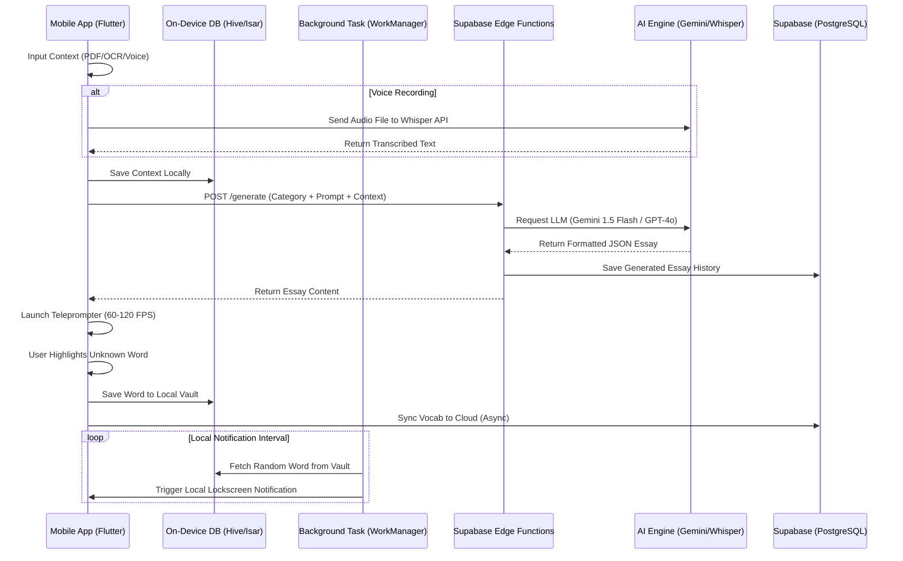
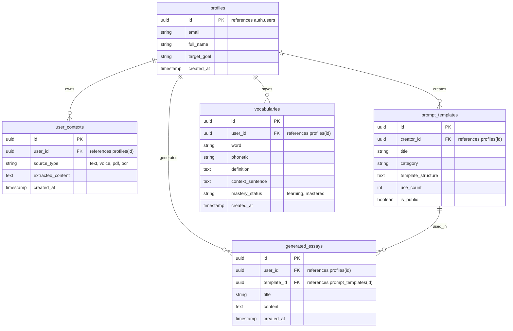

# PRD — BeMind App

## 1. Overview

**BeMind** adalah aplikasi mobile pelancar bahasa Inggris (*English Fluency Builder*) berbasis AI-Native yang menggabungkan *Multi-Modal Personalization Engine*, *Narrator Teleprompter Reading*, *Interactive Vocabulary Extraction*, *Crowdsourced Prompt Template Marketplace* ("Canva for Prompts"), dan *On-Device Passive Learning Notification*.

Masalah utama yang diselesaikan adalah ketidakmampuan murid/pengguna dalam menghafal atau menggunakan bahasa Inggris secara kontekstual karena materi yang dipelajari terlalu umum dan tidak relevan dengan kehidupan pribadi mereka. BeMind menyelesaikan masalah ini dengan menghasilkan esai/narasi yang **100% personal dan unik** (diambil dari latar belakang, CV, atau rekaman suara pengguna), lalu dilatih melalui mode *Teleprompter* berkecepatan tinggi serta notifikasi pasif harian.

## 2. High-Level Requirements

* **Platform Target:** Mobile App (iOS & Android) dibangun menggunakan **Flutter** untuk performa animasi *teleprompter* yang mulus (60–120 FPS).
* **Aksesibilitas & Offline Capabilities:** Fitur *Teleprompter*, pembacaan *Vocabulary Vault*, dan pemicu notifikasi lokal dapat berjalan tanpa koneksi internet (menggunakan basis data lokal *on-device*).
* **Personalization Engine:** Input data identitas mendukung 4 mode *multi-modal* (Text Copy-Paste, Voice Recording, PDF Upload, dan Camera OCR Scan).
* **Metode Keamanan & Hak Akses (RBAC):** Autentikasi berbasis Supabase Auth. Membedakan akun *Free User* dan *Premium/Creator User* (yang dapat memposting ke *Community Template Marketplace*).
* **Notifikasi Pasif Hemat Daya:** Memanfaatkan *on-device scheduled notification* tanpa membebankan biaya *push server* eksternal dan tetap hemat baterai.

## 3. Comprehensive Pages & Core Features Mapping (PONDASI UTAMA)

### Halaman 1: Onboarding & Auth (`/onboarding` & `/login`)

* **Tujuan Halaman:** Mengenalkan *value proposition* BeMind, memilih tujuan belajar utama, dan mengamankan akun pengguna.
* **Komponen Visual & Layout:**
* *Carousel Onboarding* interaktif dengan animasi ilustrasi pendek.
* Tombol *Social Login* menonjol dan form input kredensial yang ringkas.


* **Elemen Fitur & Kontrol Detail:**
* **Primary Goal Selector:** *Dropdown/Radio chip* bagi pengguna untuk memilih fokus utama mereka (misal: *Job Interview Prep, IELTS/TOEFL, Business Pitching, Casual Conversation*).
* **Social Auth Buttons:** Tombol *Sign in with Google* dan *Sign in with Apple*.
* **Email/Password Form:** Input teks untuk *email*, *password* (lengkap dengan *toggle hide/show password*), dan tombol *Login / Register*.


* **Integrasi System & Backend:** Terhubung ke **Supabase Auth**. Membuat entitas baru di tabel `profiles` secara otomatis saat registrasi pertama kali.

---

### Halaman 2: Personal Context Vault (`/context-vault`)

* **Tujuan Halaman:** Mengelola dan mengunggah data latar belakang pribadi pengguna yang akan di-inject ke dalam AI Generator.
* **Komponen Visual & Layout:**
* *Tab View* horizontal untuk 4 metode input data (Text, Voice, PDF, OCR Scan).
* Kartu status indikator "Personal Background Strength" (misal: *Profile Completeness 85%*).


* **Elemen Fitur & Kontrol Detail:**
* **Tab 1: Direct Text Input:** *Textarea* besar untuk *copy-paste* catatan pribadi, resume singkat, atau latar belakang karir.
* **Tab 2: Voice Note Extractor:** Tombol rekam suara *Hold/Tap-to-Record*, pengukur gelombang audio (*waveform visualizer*), dan pemutar ulang (*audio preview*). *User Action:* Mengonversi suara pengguna menjadi teks via Whisper API.
* **Tab 3: PDF Document Uploader:** *File picker container* drag-and-drop. Memungkinkan pilihan dokumen CV/Resume. *User Action:* Mengekstrak teks dari PDF menggunakan pustaka `pdf_text`.
* **Tab 4: Camera OCR Scanner:** Jendela *viewfinder* kamera dengan *overlay framing*. *User Action:* Mengambil foto dokumen/catatan fisik dan mengolahnya dengan `google_mlkit_text_recognition`.
* **Save Context Button:** Tombol menyimpan konteks ke database lokal (Hive/Isar) dan sinkronisasi ke Supabase.


* **Integrasi System & Backend:** Data diekstrak dan disimpan di tabel `user_contexts` (Supabase) dan disalin ke *storage* lokal **Hive/Isar** untuk pengolahan instan.

---

### Halaman 3: AI Narrative Generator & Theme Selection (`/generate-essay`)

* **Tujuan Halaman:** Memilih kategori kuis/tema dan menggabungkannya dengan konteks pribadi untuk menghasilkan narasi unik.
* **Komponen Visual & Layout:**
* *Grid View* kategori utama (*IELTS, Job Interview, Pitching, dll.*).
* Kartu pemilih *Community Template* yang dapat di-*remix*.
* *Modal bottom sheet* untuk penyesuaian parameter AI.


* **Elemen Fitur & Kontrol Detail:**
* **Category & Sub-Topic Selector:** Kartu kategori interaktif. Jika *IELTS* dipilih, muncul sub-topik (misal: *Part 2 Speaking Cue Card*).
* **Community Template Injector:** Tombol untuk memilih *prompt template* dari komunitas (misal: *"STAR Method Interview Answer"*).
* **AI Parameter Adjustment:** *Slider* untuk mengatur *Difficulty Level* (A2, B2, C1) dan *Tone* (Formal, Conversational, Academic).
* **"Generate My Custom Narrative" Button:** Tombol memicu pemanggilan AI. Menampilkan indikator *loading* animasi skeleton.


* **Integrasi System & Backend:** Mengirimkan *payload* gabungan (*Category Structure* + *Community Prompt* + *Selected User Context*) ke **Edge Functions / Backend API** yang memanggil **Gemini 1.5 Flash / GPT-4o**.

---

### Halaman 4: Teleprompter Reader & Interactive Extractor (`/teleprompter/[essay_id]`)

* **Tujuan Halaman:** Halaman utama melatih kelancaran membaca, ritme, serta ekstraksi kosakata asing secara interaktif.
* **Komponen Visual & Layout:**
* Layar penuh (*full-screen view*) fokus dengan teks ukuran besar.
* Panel kontrol *Floating Overlay* di bagian bawah (Play/Pause, WPM slider, Font size).


* **Elemen Fitur & Kontrol Detail:**
* **Auto-Scrolling Engine:** Teks bergerak otomatis dari bawah ke atas. Kecepatan dikontrol secara presisi antara 60 hingga 300 *Words Per Minute* (WPM).
* **WPM Controller Slider:** Controls untuk menaikkan/menurunkan kecepatan gulir teks secara *real-time*.
* **Interactive Word Highlighter:** *User Action:* Pengguna mengetuk atau meng-*highlight* kata/frasa asing. Gerakan scrolling otomatis berhenti sementara.
* **Quick Translation Pop-up:** Tampilan *modal sheet* saat kata diklik; menampilkan phonetic symbol, arti kata, audio pengucapan (TTS), dan contoh kalimat asli.
* **"Add to Vocabulary Vault" Button:** Tombol ikon bintang untuk menyimpan kata terpilih ke dalam daftar hafalan.


* **Integrasi System & Backend:** Menggunakan *state management* lokal Flutter (60-120 FPS). Penyimpanan kata terpilih langsung masuk ke **Hive/Isar Local DB** dan dijadwalkan ke *Background Notification*.

---

### Halaman 5: Personal Vocabulary Vault & Practice (`/vocab-vault`)

* **Tujuan Halaman:** Mengelola daftar kosakata yang telah diekstrak dan melatih ingatannya secara berkala.
* **Komponen Visual & Layout:**
* *List View* / *Grid View* kartu kosakata.
* Top Bar berisi bilah pencarian (*search bar*) dan filter kategori masteri.


* **Elemen Fitur & Kontrol Detail:**
* **Search & Filter Bar:** Input teks untuk mencari kata, *filter chip* berdasarkan status (*Learning, Mastered, Need Review*).
* **Vocab Card Item:** Menampilkan kata, simbol fonetik, tombol pemutar audio, serta contoh kalimat yang di-generate dari esai asli.
* **Flashcard Mode Button:** Tombol mengubah tampilan menjadi mode *Flashcard Flip* interaktif untuk pengujian memori mandiri.
* **Delete / Archive Actions:** Opsi mengusap (*swipe-to-delete*) untuk menghapus kata dari *vault*.


* **Integrasi System & Backend:** Membaca langsung dari **Hive/Isar Local DB**. Perubahan status kosakata disinkronkan ke tabel `vocabularies` di **Supabase**.

---

### Halaman 6: Community Template Marketplace / "Canva for Prompts" (`/marketplace`)

* **Tujuan Halaman:** Pusat komunitas di mana pengguna dapat mencari, membagikan, dan meng-copy *Prompt Template* unik buatan pengguna lain.
* **Komponen Visual & Layout:**
* *Banner Header* promosi *Template of the Week*.
* *Masonry Grid* atau *Feed List* kartu *Template Prompt*.


* **Elemen Fitur & Kontrol Detail:**
* **Template Search & Filter:** Filter berdasarkan *Rating, Usage Count, Category* (misal: *Best for Tech Interviews*).
* **Template Card Item:** Menampilkan nama *creator*, jumlah berapa kali di-remix, sampel output esai, dan tombol "Use Template".
* **"Remix This Template" Button:** *User Action:* Mengambil struktur *prompt* orang lain dan otomatis menginjeksi data pribadi dari *Context Vault* milik sendiri.
* **Publish Prompt Form (Floating Button):** Form bagi *Creator* untuk mengunggah struktur *prompt* ciptaannya sendiri, mengisi variabel dinamis, serta memberikan deskripsi.


* **Integrasi System & Backend:** Memuat data dari tabel `prompt_templates` di **Supabase**. Menghitung jumlah penggunaan (*use_count*) setiap kali template di-remix.

---

### Halaman 7: Settings & Notification Manager (`/settings`)

* **Tujuan Halaman:** Mengatur preferensi akun, kustomisasi jadwal notifikasi pasif, serta mengelola data lokal dan langganan.
* **Komponen Visual & Layout:**
* *Grouped List View* standar antarmuka pengaturan mobile.


* **Elemen Fitur & Kontrol Detail:**
* **Profile & Account Management:** Input edit *Full Name*, opsi ubah kata sandi, dan tombol *Logout*.
* **Smart Background Vocabulary Notification Toggle:** *Switch toggle* untuk mengaktifkan/mematikan notifikasi pasif di *lockscreen*.
* **Notification Frequency Picker:** *Dropdown* interval notifikasi (misal: *3 kali sehari, 5 kali sehari, Setiap jam*).
* **Active Hours Range:** Pemilih waktu (*Time Picker*) jam mulai (misal: 08:00) dan jam selesai (misal: 21:00) agar notifikasi tidak mengganggu jam tidur.
* **Offline Data Sync Button:** Tombol manual untuk melakukan paksa sinkronisasi (*force sync*) data Hive/Isar ke Supabase.
* **Clear Local Storage Options:** Tombol membersihkan *cache* dokumen PDF dan gambar OCR.


* **Integrasi System & Backend:** Mengonfigurasi plugin `flutter_local_notifications` dan pemicu jadwal `workmanager` pada sistem operasi Android/iOS.

---

## 4. User Flow & System Interaction

```
[1. Onboarding/Login] ──> [2. Fill Personal Context Vault] 
                                    │ (Voice / PDF / OCR / Text)
                                    ▼
[4. Teleprompter Reading] <── [3. Generate AI Essay]
  │ (High-FPS Scroll & WPM)         ▲ (Combines Category + Context)
  │                                 │
  ├─► [Highlight Foreign Word] ─────┴─► [Community Marketplace]
  │        │                             (Remix Prompt Templates)
  │        ▼
  └─► [Saved to Vocab Vault] ──> [Background Notification Service]
                                  (Pushes cards to Lock Screen)

```

1. **Persiapan Data (Context Building):** Pengguna masuk ke aplikasi, membuka `/context-vault`, dan memasukkan CV/catatan suara.
2. **Generasi & Pemilihan:** Pengguna menuju `/generate-essay`, memilih kategori (misal: *Job Interview*), atau mengambil template dari `/marketplace`.
3. **Proses AI:** Sistem mengambil struktur template, menggabungkannya dengan latar belakang unik pengguna dari *Context Vault*, lalu mengeksekusi LLM via API.
4. **Latihan Kelancaran (Teleprompter):** Pengguna membaca narasi yang telah di-generate di halaman `/teleprompter`. Pengguna mengatur WPM dan mengklik kata-kata asing.
5. **Ekstraksi Kosakata:** Kata yang diklik disimpan ke `/vocab-vault`.
6. **Passive Learning:** Di latar belakang, *WorkManager* mengambil kata acak dari *Vault* lokal dan memunculkan notifikasi di *lockscreen* sesuai interval jadwal pada `/settings`.

---

## 5. Technical Architecture

Aplikasi BeMind menggunakan arsitektur *Hybrid Serverless-First* dengan strategi *Offline-First Local Storage*.



---

## 6. Database Schema

Berikut adalah struktur database utama di Supabase (PostgreSQL) dan disalin sebagian pada database lokal *on-device* (Hive/Isar):



| Tabel | Deskripsi |
| --- | --- |
| **profiles** | Menyimpan data profil pengguna, sasaran belajar utama, serta preferensi dasar. |
| **user_contexts** | Menampung hasil ekstraksi data pribadi dari 4 metode input (Text, Voice, PDF, OCR). |
| **prompt_templates** | Katalog *template prompt* berbasis komunitas (Model "Canva for Prompts"). |
| **generated_essays** | Arsip esai/narasi buatan AI yang siap dibaca pada mode *Teleprompter*. |
| **vocabularies** | Daftar kata asing yang disalin ke lokal (Hive/Isar) sebagai pemicu *Background Notification*. |

---

## 7. Design & Technical Constraints

### Tech Stack Recommendation

* **Frontend Mobile:** Flutter (Dart) — Diharuskan menggunakan animasi *CustomPainter* / *ScrollController* berkinerja tinggi untuk mendukung pembacaan *Teleprompter* mulus (60–120 FPS).
* **Local On-Device Database:** Hive / Isar Database — Dioptimalkan untuk operasi I/O yang sangat cepat di memori HP.
* **Backend & Cloud Database:** Supabase (PostgreSQL + Supabase Auth + Edge Functions).
* **AI & Machine Learning APIs:**
* **Text Generation:** Google Gemini 1.5 Flash (atau OpenAI GPT-4o).
* **Audio Processing:** OpenAI Whisper API (Speech-to-Text).
* **Document Parsing & OCR:** `pdf_text` (Parsing PDF) dan `google_mlkit_text_recognition` (Camera OCR).


* **Notification Engine:** `flutter_local_notifications` terintegrasi dengan `workmanager` untuk mengeksekusi tugas latar belakang tanpa *server push*.

### UI/UX Direction

* **Tema Visual:** *Dark Mode Default* dengan aksen kontras yang nyaman untuk mata saat membaca teks *teleprompter* dalam waktu lama.
* **Teleprompter Interface:** Antarmuka bersih (*clean layout*) tanpa elemen pengganggu saat teks mulai bergulir. Tombol interaksi utama dibuat membesar (*thumb-friendly*) untuk memudahkan pengoperasian satu tangan.
* **Typography & Typography Rules:**
* **Sans:** `Geist Mono, ui-monospace, monospace` (Digunakan untuk UI antarmuka, statistik, dan tombol kontrol).
* **Serif:** `serif` (Diperbolehkan untuk teks esai/narasi dalam mode pembacaan panjang agar mata tidak lelah).
* **Mono:** `JetBrains Mono, monospace` (Digunakan untuk notifikasi kosakata dan fonetik).


### Backend & AI Constraint

* **Document Constraints:** Agen pengkodingan WAJIB menggunakan **"Context7"** saat proses pengerjaan untuk menarik dokumentasi terbaru mengenai **Flutter 3.x**, **Supabase Edge Functions**, dan integrasi **Gemini 1.5 Flash API**.
* **Strict Prompt Output:** API prompt harus diprogram untuk mengembalikan respon berformat **JSON bersih** tanpa menyertakan label teknis seperti `[Hook]`, `[Introduction]`, atau penjelasan tambahan di luar isi narasi agar dapat langsung di-render oleh UI *Teleprompter*.